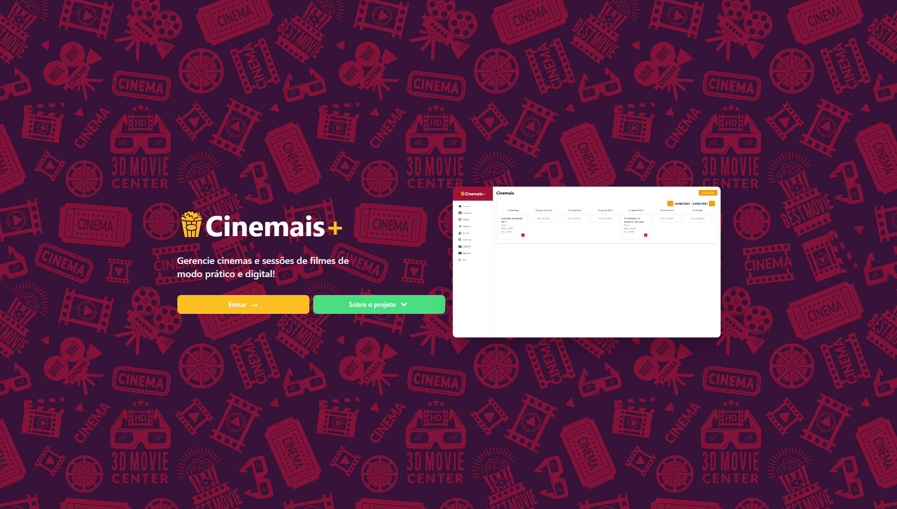

# 📽️ Cinemais - API

Manage movie theaters and film screenings in practical and digital way!

<p align="center">
  
  <span>Project Interface</span>
</p>

<p align="center">
  
  
  
  
</p>

## 💻 Technologies

* [Node](https://nodejs.org/en/)
* [Typescript](https://www.typescriptlang.org/)
* [Express](https://expressjs.com/)
* [Prisma](https://www.prisma.io/)
* [Zod](https://zod.dev/)

## 🏃 Getting Started

First, clone this repository and access the created folder:

```bash
# Cloning repository
git clone https://github.com/iamtheluiz/cinemais-api.git

cd cinemais-api/
```

Inside the folder, install all project dependencies:

```bash
npm install
# or
yarn install
```

Copy the `.env.example` file and rename it to `.env` and edit with the desired configurations:

```bash
cp .env.example .env
```

After that, run the following command to generate the database tables:

```bash
npx prisma db push
```

Run the following command to generate the database seed:

```bash
npx prisma db seed
```

The previous command will create a default administrator user with the following credentials:

```bash
email: admin@admin.com
password: @admin123
```

Finally, run the following command to start the server:

```bash
npm run dev
# or
yarn dev
```

Now you can access [`localhost:3000`](http://localhost:3000) in your browser.

## Prisma

Important points:
* Generating a migration:
  - npx prisma migrate dev --name migration_name
* Viewing the database:
  - npx prisma studio
* Apply settings to the database:
  - npx prisma db push
* Database seed:
  - npx prisma db seed

## 💼 Authors

* **Luiz Gustavo** - *Development* - [iamtheluiz](https://github.com/iamtheluiz)
  * Website: https://iamtheluiz.github.io
  * Github: [@iamtheluiz](https://github.com/iamtheluiz)
  * LinkedIn: [Luiz Gustavo da Silva Vasconcellos](https://www.linkedin.com/in/luiz-gustavo-da-silva-vasconcellos-05192a192?lipi=urn%3Ali%3Apage%3Ad_flagship3_profile_view_base_contact_details%3BbQkVQ3sTTv6XCn%2FiToGGcA%3D%3D)

<!-- ## 📃 License

This project is under the MIT License - see the [LICENSE](LICENSE) file for details. -->
